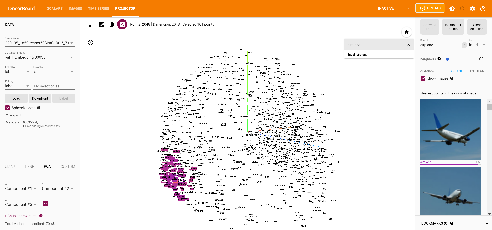

# **SimCLR on MNIST CIFAR10 STL10**

This project is a SimCLR training pipeline compatible with :
- MNIST Dataset
- CIFAR10 Dataset
- TMarks Dataset
- Shearo Dataset

To use this repo, install library / dependancies :

    conda create --name vae
    conda activate vae
    conda install pytorch torchvision cudatoolkit=11.3 -c pytorch
    pip install -r requirements.txt

To launch a training:

    python train_CLR.py    # train contrastive learning

In order to modify the dataset, you can use use argparse parameters.

## **SimCLR**
In this repo, we have implemented :
|What                         |Code             |
|-----------------------------|-----------------|
|A Convolutive Encoder        | $f(.)$          |
|A Non Linear Projection Head | $g(.)$          |
|Augmentations                |$(t_1(.),t_2(.))$|

Let's say we have an image $X$. 
$X_1 = t_1(X)$ and
$X_2 = t_2(X)$

We have features space : 
$h_1=f(X_1)$ and $h_2=f(X_2)$

And the prediction space : 
$z_1=g(h_1)$ and $z_2=g(h_2)$

